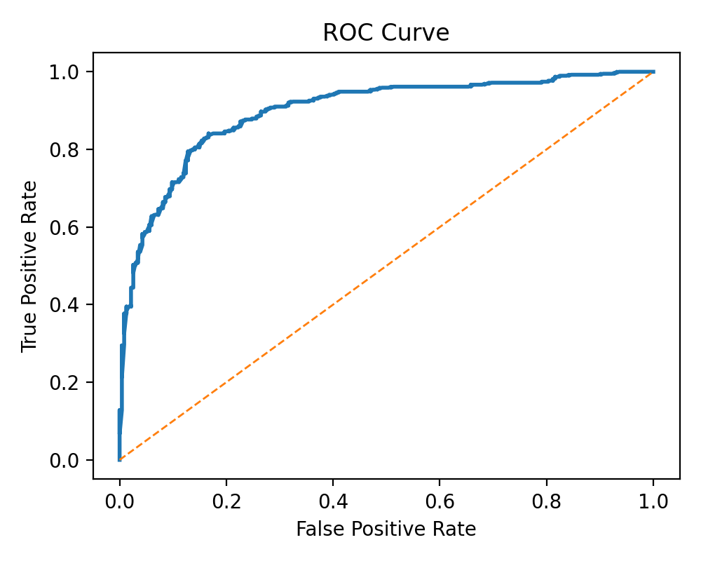
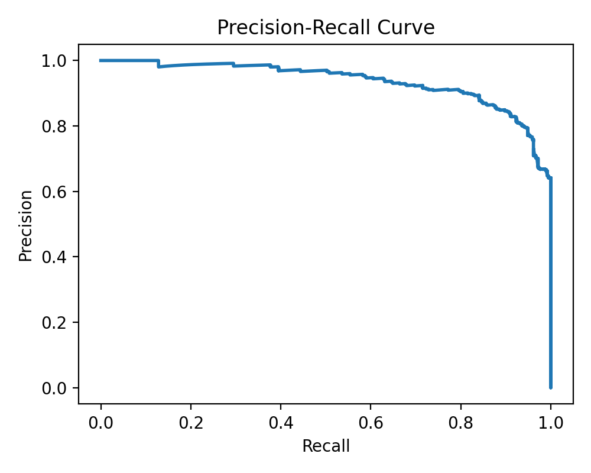
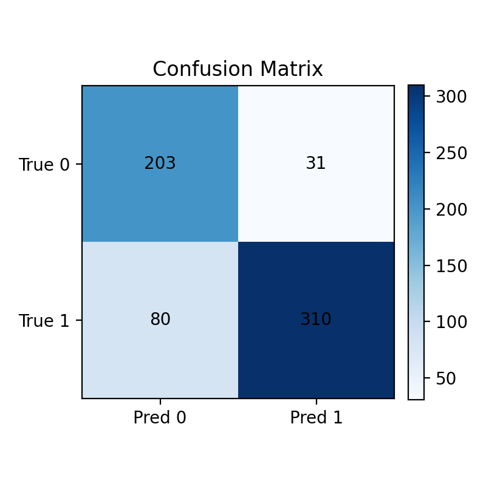
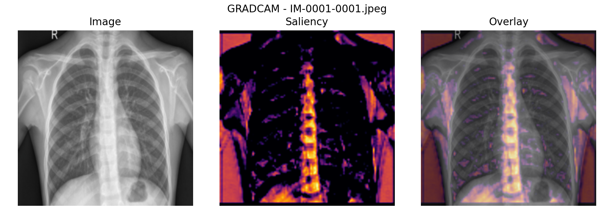
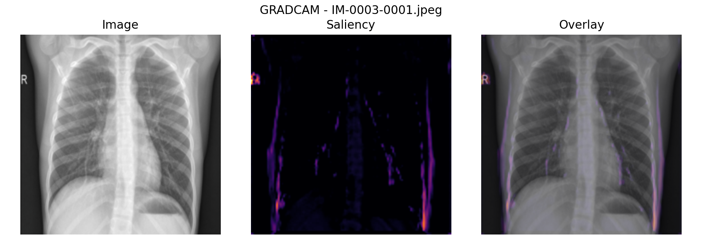
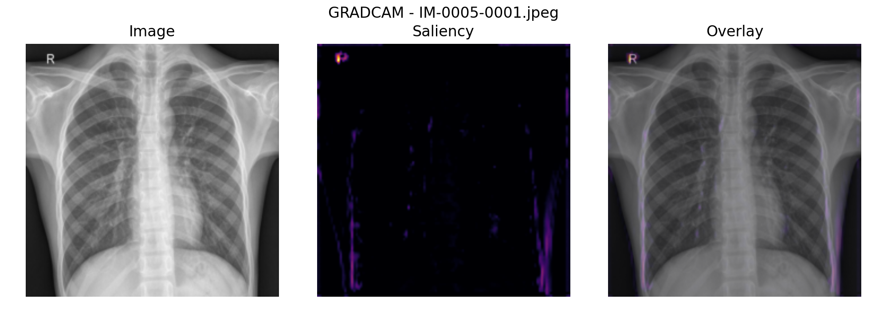

# CS7643 Pneumonia Midterm Pipeline

This repository contains a reproducible implementation scaffold for the CS7643 milestone project:
binary pneumonia detection on this dataset: `[chest xrays](https://www.kaggle.com/datasets/paultimothymooney/chest-xray-pneumonia/data)` with baselines, evaluation, and interpretability.

## What is included

- `prepare_data.py`: build a filtered, patient-level split manifest
- `train.py`: train `cnn`, `resnet50`, or `dinov2_linear`
- `evaluate.py`: compute metrics and generate report-ready artifacts
- `interpret.py`: create Grad-CAM/DINO maps and faithfulness reports
- `configs/`: example JSON configs for CNN, ResNet-50, DINOv2, and a small smoke test

## Installation

Create a virtual environment and install the minimal dependencies:

```bash
python3 -m venv .venv
source .venv/bin/activate
pip install -r requirements.txt
```

## Expected data inputs

For the Kaggle pneumonia dataset, `prepare_data.py` reads a directory layout like:

```text
chest_xray/
  train/
    NORMAL/
    PNEUMONIA/
  val/
    NORMAL/
    PNEUMONIA/
  test/
    NORMAL/
    PNEUMONIA/
```

## Example workflow

1. Build the manifest:

If you are using the smaller Kaggle dataset
`paultimothymooney/chest-xray-pneumonia`, point `prepare_data.py` at the extracted folder root:

```bash
python3 prepare_data.py \
  --kaggle-pneumonia-root /path/to/chest_xray \
  --output-manifest artifacts/manifests/chestxray14_binary.csv
```

This will:

- read the provided `train/val/test` folder split
- map `NORMAL -> No Finding`
- map `PNEUMONIA -> Pneumonia`
- create the same manifest format the training pipeline already expects


## Midterm report checklist

The commands below map directly to the `Experiments & Results` section requirements for the
midterm report. You can assume GPU is available when running the real experiments; the configs
use `device: "auto"`, which will pick CUDA if PyTorch can see it.

### 1. Established dataset or data-collection pipeline specified

Use this command for the Kaggle pneumonia dataset:

```bash
python3 prepare_data.py \
  --kaggle-pneumonia-root /path/to/chest_xray \
  --output-manifest artifacts/manifests/chestxray14_binary.csv
```

This gives you the dataset pipeline story for the report:

- source dataset: Kaggle `chest-xray-pneumonia`
- class mapping: `PNEUMONIA` vs `NORMAL`
- provided split folders preserved
- local manifest created for training/evaluation

After this runs, the dataset manifest will be at:

- `artifacts/manifests/chestxray14_binary.csv`

### 2. Baseline evaluated with proposed metrics

Run the two baseline models first.

Baseline 1: small CNN

```bash
python3 train.py --config configs/chestxray14_cnn.json
python3 evaluate.py --config configs/chestxray14_cnn.json
python3 interpret.py --config configs/chestxray14_cnn.json
```

Baseline 2: fine-tuned ResNet-50

```bash
python3 train.py --config configs/chestxray14_resnet50.json
python3 evaluate.py --config configs/chestxray14_resnet50.json
python3 interpret.py --config configs/chestxray14_resnet50.json
```

These runs will generate the baseline metrics and visuals you need:

- metrics JSON: `artifacts/experiments/<experiment_name>/metrics/test_metrics.json`
- prediction CSVs: `artifacts/experiments/<experiment_name>/predictions/`
- ROC/PR/confusion plots: `artifacts/experiments/<experiment_name>/plots/`
- explanation maps and faithfulness curves: `artifacts/experiments/<experiment_name>/interpretability/`

The proposed metrics already implemented are:

- `ROC-AUC`
- `PR-AUC`
- `F1`
- `precision`
- `recall / sensitivity`
- `specificity`
- confusion matrix

### 3. Results for your method (numbers/visuals preferred)

Run the upgraded method:

```bash
python3 train.py --config configs/chestxray14_dinov2_linear.json
python3 evaluate.py --config configs/chestxray14_dinov2_linear.json
python3 interpret.py --config configs/chestxray14_dinov2_linear.json
```

To generate side-by-side interpretability comparisons for the report, compare DINOv2 against
the ResNet baseline on the same test images:

```bash
python3 interpret.py \
  --config configs/chestxray14_dinov2_linear.json \
  --comparison-config configs/chestxray14_resnet50.json
```

This gives you:

- final numbers for the proposed method
- DINO explanation maps
- faithfulness reports
- side-by-side DINO vs ResNet explanation figures

## Visuals to include at the bottom of the midterm report

Once the runs are complete, these are the visuals that should be inserted into the report:

- Dataset pipeline figure:
  class balance by split from `artifacts/experiments/<experiment_name>/plots/class_balance.png`
- Baseline results figure:
  ROC curve, PR curve, and confusion matrix from the strongest baseline run
- Proposed method results figure:
  ROC curve, PR curve, and confusion matrix from the DINOv2 run
- Qualitative error analysis:
  examples referenced from `top_correct.csv` and `top_errors.csv`
- Interpretability figure:
  one Grad-CAM example from the ResNet run and one DINO map from the DINOv2 run
- Comparison figure:
  side-by-side ResNet vs DINO explanation outputs from `interpretability/comparisons/`
- Faithfulness figure:
  deletion/confidence-drop curves from the `interpretability/` directory
- Metrics table:
  CNN vs ResNet-50 vs DINOv2 using the values from each `test_metrics.json`

## Current CNN results

The repository currently includes one completed baseline run for the CNN experiment:

- experiment name: `cnn_weighted_bce`
- config: `configs/chestxray14_cnn.json`
- best validation epoch: `7`
- loss: `weighted_bce`

Test-set metrics from `artifacts/experiments/cnn_weighted_bce/metrics/test_metrics.json`:

- threshold: `0.4107`
- accuracy: `0.8253`
- precision: `0.8980`
- recall / sensitivity: `0.8128`
- specificity: `0.8462`
- F1: `0.8533`
- ROC-AUC: `0.8955`
- PR-AUC: `0.9242`
- confusion matrix: `TP=317`, `TN=198`, `FP=36`, `FN=73`

Generated CNN artifacts:

- plots:
  `artifacts/experiments/cnn_weighted_bce/plots/test_roc.png`
  `artifacts/experiments/cnn_weighted_bce/plots/test_pr.png`
  `artifacts/experiments/cnn_weighted_bce/plots/test_confusion_matrix.png`
- Grad-CAM examples:
  `artifacts/experiments/cnn_weighted_bce/interpretability/`
- full metrics/history:
  `artifacts/experiments/cnn_weighted_bce/metrics/`

### CNN plots

ROC curve:



Precision-recall curve:



Confusion matrix:



### CNN Grad-CAM examples






