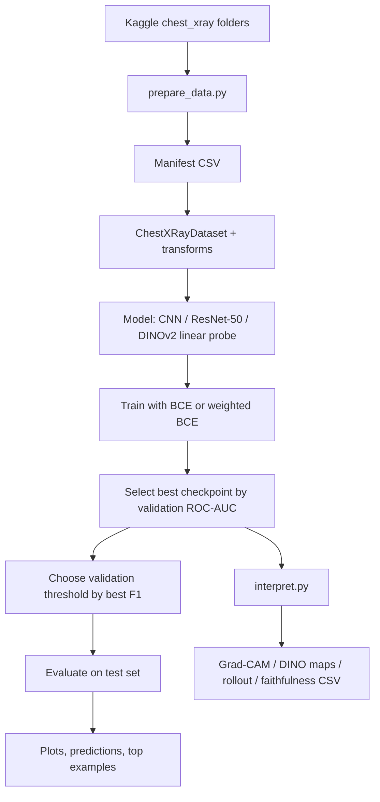
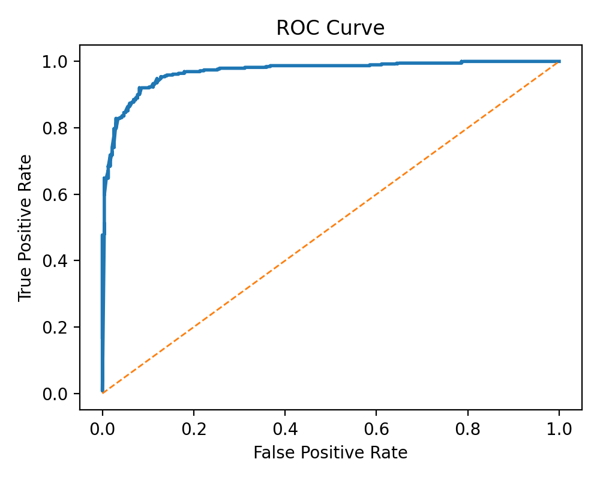
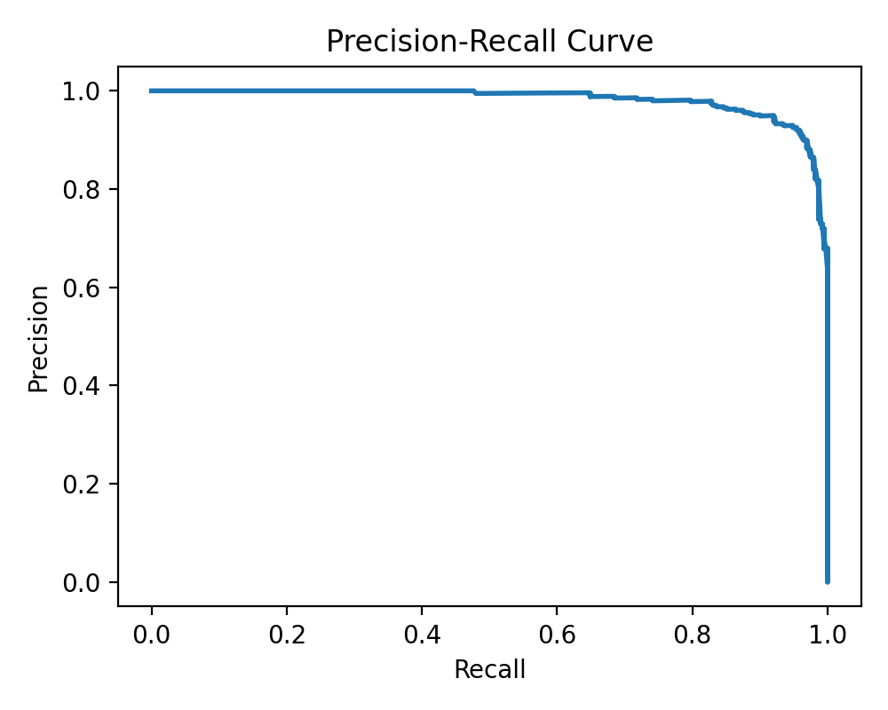
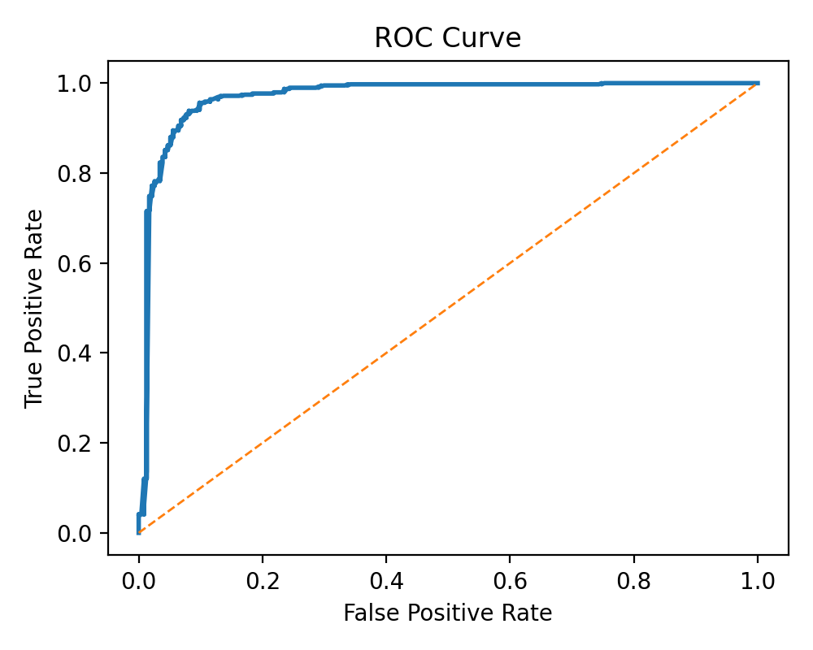
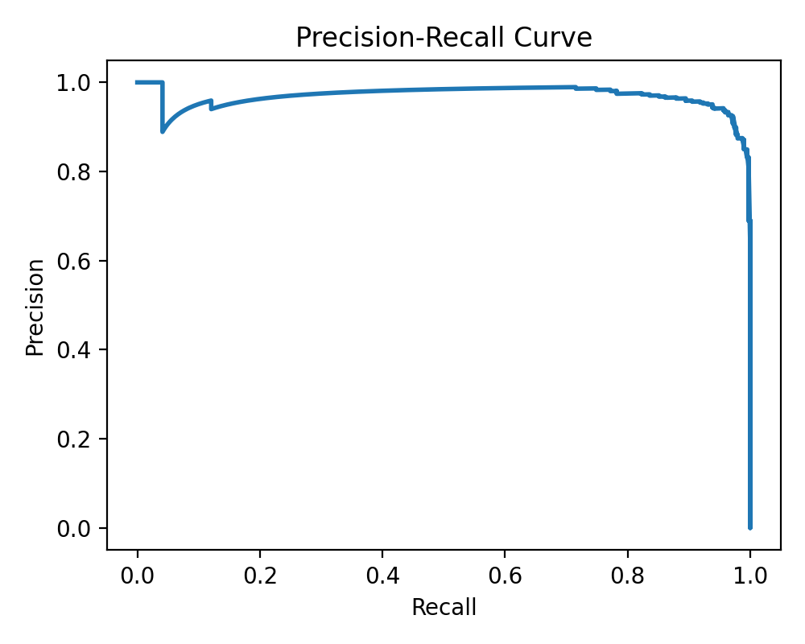
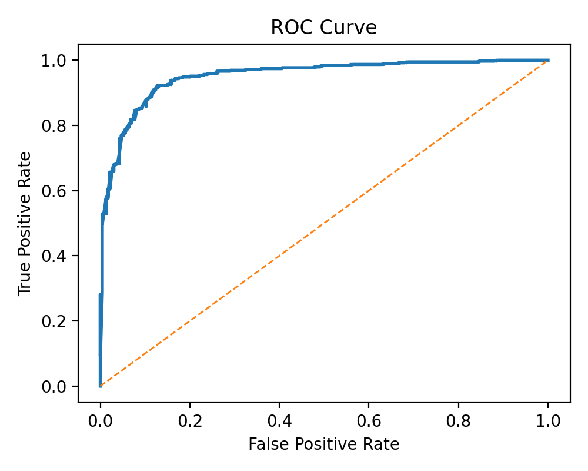
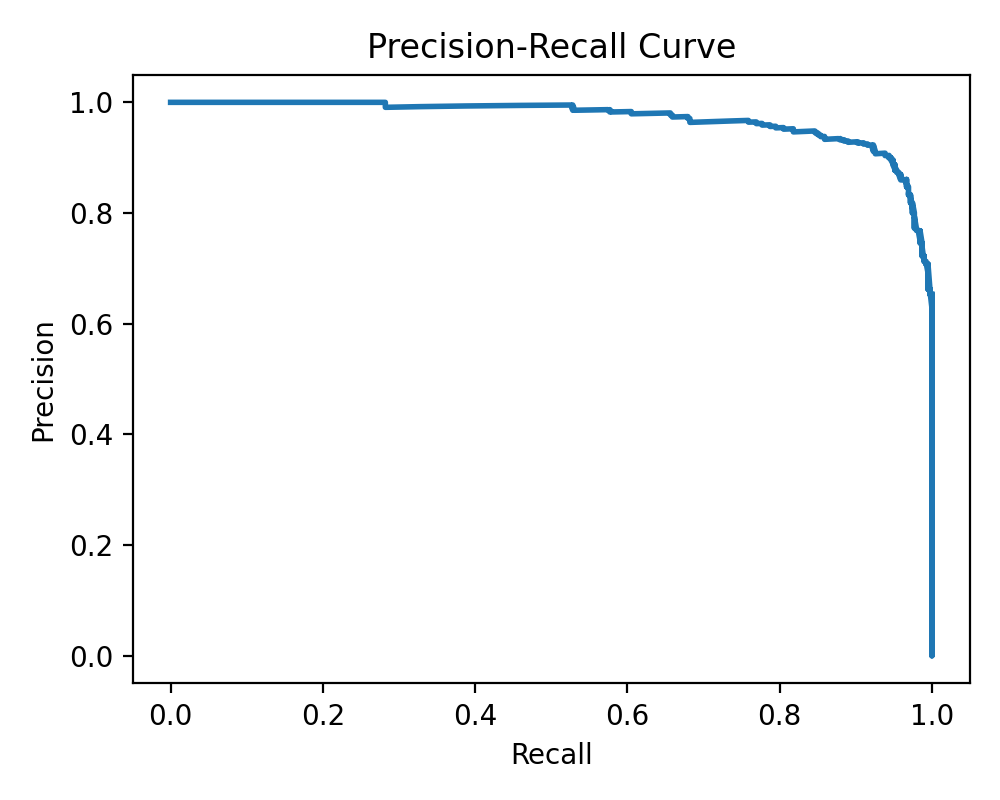
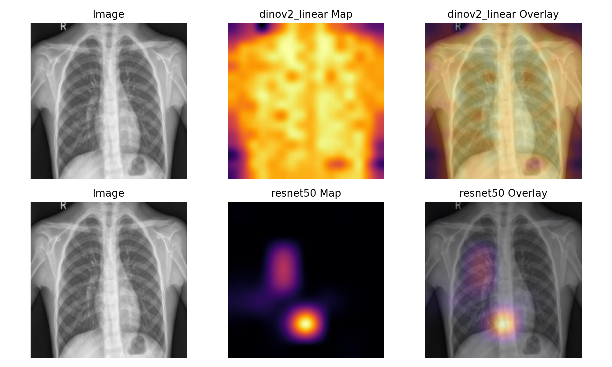
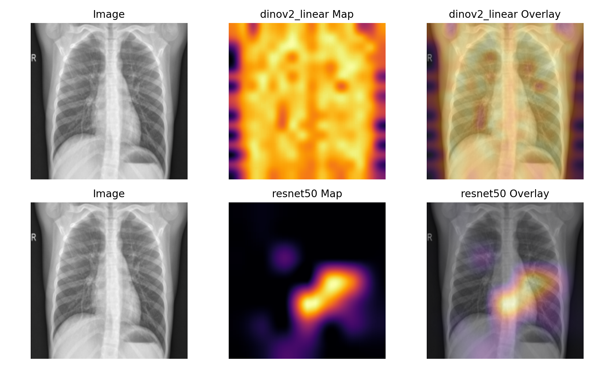

# CS7643 Pneumonia Interpretability Project

This repository contains the training, evaluation, and interpretability pipeline for a CS7643 midterm project on binary chest X-ray classification: `PNEUMONIA` vs `NORMAL` (`No Finding` in the internal manifest format). The current implementation uses the smaller Kaggle dataset [chest-xray-pneumonia](https://www.kaggle.com/datasets/paultimothymooney/chest-xray-pneumonia/data) and includes five completed experiment folders under `artifacts/experiments/`.

## Repository layout

- `prepare_data.py`: build a manifest from the Kaggle folder layout.
- `train.py`: train one experiment from a JSON config.
- `evaluate.py`: recompute metrics, predictions, and plots from a checkpoint.
- `interpret.py`: generate Grad-CAM, DINO saliency maps, attention rollout, and faithfulness reports.
- `summarize_results.py`: aggregate `test_metrics.json` files into a single CSV.
- `configs/`: experiment configs for CNN, ResNet-50, and DINOv2 linear probe variants.
- `artifacts/experiments/`: saved metrics, plots, and interpretability outputs from completed runs.

## Installation

```bash
python3 -m venv .venv
source .venv/bin/activate
pip install -r requirements.txt
```

## Dataset and manifest pipeline

The code currently targets the Kaggle dataset:

```text
chest_xray/
  train/
    NORMAL/
    PNEUMONIA/
  val/
    NORMAL/
    PNEUMONIA/
  test/
    NORMAL/
    PNEUMONIA/
```

Build the manifest with:

```bash
python3 prepare_data.py \
  --kaggle-pneumonia-root /path/to/chest_xray \
  --output-manifest artifacts/manifests/chestxray14_binary.csv
```

The Kaggle version already provides `train/val/test` folders, so this path preserves those splits instead of rebuilding patient-level splits. Because the Kaggle dataset does not expose real patient IDs, the manifest assigns synthetic IDs per image to keep the rest of the pipeline format consistent.

Current manifest summary from [artifacts/manifests/chestxray14_binary.csv](/Users/govindramesh/GeorgiaTech/CS%207643/Project/artifacts/manifests/chestxray14_binary.csv):

| Split | Total | Normal | Pneumonia |
| --- | ---: | ---: | ---: |
| train | 5216 | 1341 | 3875 |
| val | 16 | 8 | 8 |
| test | 624 | 234 | 390 |

The very small validation split is an important caveat for interpreting threshold selection and early stopping.

## Hypotheses

### H1: A frozen DINOv2 encoder with a linear head will outperform ImageNet-pretrained ResNet-50

Experiment:
- Compare `resnet50_bce` vs `dinov2_linear_bce`
- Compare `resnet50_weighted_bce` vs `dinov2_linear_weighted_bce`
- Use the same manifest, image size, threshold-selection rule, and evaluation metrics

Expected result:
- We originally expected DINOv2 to produce higher `ROC-AUC` and `F1` than ResNet-50 because self-supervised pretraining should transfer stronger semantic structure than supervised ImageNet features on a small medical dataset.

Why:
- The proposal feedback emphasized moving beyond formulaic CNN baselines and adding more modern vision-model interpretability.
- A frozen DINO backbone also reduces optimization difficulty compared with fully fine-tuning a large transformer.

Current status from artifacts:
- This hypothesis is **not supported by the current runs**.
- [artifacts/experiments/resnet50_bce/metrics/test_metrics.json](/Users/govindramesh/GeorgiaTech/CS%207643/Project/artifacts/experiments/resnet50_bce/metrics/test_metrics.json) beats [artifacts/experiments/dinov2_linear_bce/metrics/test_metrics.json](/Users/govindramesh/GeorgiaTech/CS%207643/Project/artifacts/experiments/dinov2_linear_bce/metrics/test_metrics.json) on both `ROC-AUC` (`0.9683` vs `0.9526`) and `F1` (`0.9031` vs `0.8988`).
- [artifacts/experiments/resnet50_weighted_bce/metrics/test_metrics.json](/Users/govindramesh/GeorgiaTech/CS%207643/Project/artifacts/experiments/resnet50_weighted_bce/metrics/test_metrics.json) also beats [artifacts/experiments/dinov2_linear_weighted_bce/metrics/test_metrics.json](/Users/govindramesh/GeorgiaTech/CS%207643/Project/artifacts/experiments/dinov2_linear_weighted_bce/metrics/test_metrics.json).

### H2: Class-imbalance-aware loss will improve pneumonia recall and PR-AUC

Experiment:
- Compare `bce` vs `weighted_bce` for ResNet-50
- Compare `bce` vs `weighted_bce` for DINOv2

Expected result:
- Weighted BCE should improve pneumonia-class recall because the training set is heavily skewed toward pneumonia (`3875` positives vs `1341` normals in train), and the weighted loss raises the penalty for false negatives.

Why:
- In a screening-style medical setting, missing pneumonia is usually more costly than generating some additional false positives.

Current status from artifacts:
- This hypothesis is **supported for ResNet-50**.
- ResNet recall improves from `0.8487` with BCE to `0.9462` with weighted BCE, and F1 improves from `0.9031` to `0.9437`.
- It is **not supported for DINOv2** in the current runs: DINO recall decreases slightly from `0.8538` to `0.8462`, and PR-AUC changes only marginally.

### H3: Modern DINO-based explanations will be more faithful than Grad-CAM

Experiment:
- Compare Grad-CAM outputs from CNN/ResNet with DINO patch-similarity maps and DINO attention rollout.
- Use quantitative faithfulness metrics saved in `faithfulness_report.csv`: `confidence_drop`, `deletion_auc`, and `insertion_auc`.

Expected result:
- We expected DINO explanations to behave more like semantically meaningful regions because the backbone is transformer-based and exposes patch-level features directly.

Why:
- This directly responds to the proposal feedback asking for more interesting interpretability than only Grad-CAM.

Current status from artifacts:
- This hypothesis is **not clearly supported yet**.
- For example, [artifacts/experiments/resnet50_bce/interpretability/faithfulness_report.csv](/Users/govindramesh/GeorgiaTech/CS%207643/Project/artifacts/experiments/resnet50_bce/interpretability/faithfulness_report.csv) has mean Grad-CAM `confidence_drop = -0.0361`, while [artifacts/experiments/dinov2_linear_bce/interpretability/faithfulness_report.csv](/Users/govindramesh/GeorgiaTech/CS%207643/Project/artifacts/experiments/dinov2_linear_bce/interpretability/faithfulness_report.csv) shows DINO patch maps at `-0.0976` and DINO rollout at `-0.4120`.
- Negative confidence drop means masking the “salient” region increased the model confidence, which is a sign the explanation is not yet especially faithful under this test.
- The DINO comparison figures are still useful qualitatively, but the quantitative faithfulness story should be written cautiously.

## Training pipeline

### High-level flow



### Pseudocode

```text
load manifest
verify split integrity and clean negatives
build dataloaders(train, val, test)
build model from config
compute train-set pos_weight if using weighted BCE
for epoch in 1..N:
    train for one epoch with Adam
    run validation inference
    compute validation ROC-AUC / PR-AUC / F1
    if validation ROC-AUC improves:
        save checkpoint
    else:
        increment patience
    stop early if patience limit is hit
reload best checkpoint
choose operating threshold on validation set using best F1
evaluate on test set with that fixed threshold
save metrics, predictions, curves, confusion matrix
run interpretability on held-out test examples
```

## Models, objectives, and regularization

### Architectures

- `cnn`: a small 3-block convolutional network with `Conv -> BatchNorm -> ReLU -> pooling`, followed by a `128 -> 64 -> 1` classifier with dropout.
- `resnet50`: ImageNet-pretrained `torchvision.models.resnet50` with the final fully connected layer replaced by a single-logit head.
- `dinov2_linear`: a frozen `dinov2_vits14` backbone loaded through `torch.hub`, followed by a single linear classification head on top of the CLS embedding.

### Losses / objectives

- `bce`: `BCEWithLogitsLoss`
- `weighted_bce`: `BCEWithLogitsLoss(pos_weight=negatives / positives)`
- `focal`: implemented but not used in the committed results

### Regularizers

- Weight decay through Adam
- Data augmentation on the training split only:
  - resize to `224 x 224`
  - random horizontal flip
  - small random affine jitter
  - light brightness/contrast jitter
- CNN dropout: `p = 0.2`
- Frozen DINO backbone to reduce overfitting and compute cost

### Optimizer, schedule, and selection rule

- Optimizer: `Adam`
- Learning-rate schedule: none in the current implementation
- Checkpoint selection: best validation `ROC-AUC`
- Operating threshold: chosen on the validation set using best `F1`
- Early stopping: stop after `early_stopping_patience = 3` epochs without validation `ROC-AUC` improvement

## Justification for design decisions

- Kaggle dataset instead of the full NIH release:
  the smaller dataset is easier to fit into limited disk environments and is already filtered to the binary task we need.

- Preserve Kaggle-provided splits:
  this avoids extra preprocessing, but it also means we lose true patient-level leakage control because the dataset does not include real patient IDs.

- `224 x 224` inputs and RGB conversion:
  this keeps compatibility with standard ImageNet and DINO backbones while keeping training practical.

- CNN as a baseline rather than the main method:
  it gives a lightweight point of comparison but is not the intended main contribution.

- ResNet-50 as the strongest conventional baseline:
  it is widely used, easy to fine-tune, and interpretable with Grad-CAM.

- DINOv2 linear probe as the “modern” method:
  it incorporates recent self-supervised vision modeling and supports patch-level interpretability without needing dense labels.

- Faithfulness metrics in addition to saliency overlays:
  qualitative heatmaps alone are weak evidence; deletion/insertion AUC and confidence-drop tests make the interpretability claims more measurable.

## Evaluation strategy

### Dataset / benchmark

- Dataset used in the current artifacts: Kaggle chest X-ray pneumonia dataset
- Task: binary classification
  - positive class: `PNEUMONIA`
  - negative class: `NORMAL`

### Baselines

- Baseline 1: `cnn_weighted_bce`
- Baseline 2: `resnet50_bce`
- Stronger imbalance-aware baseline: `resnet50_weighted_bce`
- Proposed modern method: `dinov2_linear_bce` and `dinov2_linear_weighted_bce`

### Metrics

- `accuracy = (TP + TN) / (TP + TN + FP + FN)`
- `precision = TP / (TP + FP)`
- `recall` or `sensitivity = TP / (TP + FN)`
- `specificity = TN / (TN + FP)`
- `F1 = 2 * precision * recall / (precision + recall)`
- `ROC-AUC`: area under the ROC curve
- `PR-AUC`: area under the precision-recall curve

Interpretability metrics:

- `confidence_drop`: probability decrease after masking the most salient fraction of the image
- `deletion_auc`: area under the probability-vs-masked-fraction curve
- `insertion_auc`: area under the probability-vs-inserted-fraction curve

## Framework, hardware, and default hyperparameters

### Framework

- Python
- PyTorch
- torchvision
- Pillow
- matplotlib / seaborn-style plotting utilities

### Hardware

- The configs use `device: "auto"`, which selects CUDA if available and otherwise falls back to CPU.
- The codebase was built to run without a GPU for smoke testing, but the full ResNet-50 and DINOv2 experiments are intended for a CUDA GPU.
- The training scripts do not currently persist the exact GPU model in the artifacts, so the README cannot claim a specific GPU type for the committed results.

### Default hyperparameters

Shared defaults across current configs:

- image size: `224`
- batch size: `32` for CNN, `16` for ResNet-50 and DINOv2
- epochs: `8`
- early stopping patience: `3`
- threshold metric: `f1`
- interpretation examples: `8`
- mask fraction: `0.2`
- faithfulness curve steps: `10`
- random seed: `42`

Per-model defaults:

| Config | LR | Weight decay | Loss | Pretrained | Freeze backbone |
| --- | ---: | ---: | --- | --- | --- |
| `configs/chestxray14_cnn.json` | `1e-3` | `1e-4` | `weighted_bce` | no | no |
| `configs/chestxray14_resnet50.json` | `1e-4` | `1e-4` | `weighted_bce` | yes | no |
| `configs/chestxray14_resnet50_bce.json` | `1e-4` | `1e-4` | `bce` | yes | no |
| `configs/chestxray14_dinov2_linear.json` | `5e-4` | `1e-4` | `weighted_bce` | yes | yes |
| `configs/chestxray14_dinov2_linear_bce.json` | `5e-4` | `1e-4` | `bce` | yes | yes |

## Reproduction commands

Build the manifest:

```bash
python3 prepare_data.py \
  --kaggle-pneumonia-root /path/to/chest_xray \
  --output-manifest artifacts/manifests/chestxray14_binary.csv
```

Run all experiments:

```bash
python3 train.py --config configs/chestxray14_cnn.json
python3 evaluate.py --config configs/chestxray14_cnn.json
python3 interpret.py --config configs/chestxray14_cnn.json

python3 train.py --config configs/chestxray14_resnet50_bce.json
python3 evaluate.py --config configs/chestxray14_resnet50_bce.json
python3 interpret.py --config configs/chestxray14_resnet50_bce.json

python3 train.py --config configs/chestxray14_resnet50.json
python3 evaluate.py --config configs/chestxray14_resnet50.json

python3 train.py --config configs/chestxray14_dinov2_linear_bce.json
python3 evaluate.py --config configs/chestxray14_dinov2_linear_bce.json
python3 interpret.py --config configs/chestxray14_dinov2_linear_bce.json

python3 train.py --config configs/chestxray14_dinov2_linear.json
python3 evaluate.py --config configs/chestxray14_dinov2_linear.json
python3 interpret.py --config configs/chestxray14_dinov2_linear.json
```

Generate side-by-side ResNet vs DINO comparisons:

```bash
python3 interpret.py \
  --config configs/chestxray14_dinov2_linear_bce.json \
  --comparison-config configs/chestxray14_resnet50_bce.json

python3 interpret.py \
  --config configs/chestxray14_dinov2_linear.json \
  --comparison-config configs/chestxray14_resnet50.json
```

Summarize metrics across experiment folders:

```bash
python3 summarize_results.py --root-dir artifacts/experiments
```

## Current experiment results

Metrics below come directly from the `test_metrics.json` files in each experiment directory.

| Experiment | Accuracy | Precision | Recall | Specificity | F1 | ROC-AUC | PR-AUC |
| --- | ---: | ---: | ---: | ---: | ---: | ---: | ---: |
| `cnn_weighted_bce` | `0.8221` | `0.9091` | `0.7949` | `0.8675` | `0.8482` | `0.8978` | `0.9368` |
| `resnet50_bce` | `0.8862` | `0.9650` | `0.8487` | `0.9487` | `0.9031` | `0.9683` | `0.9822` |
| `resnet50_weighted_bce` | `0.9295` | `0.9413` | `0.9462` | `0.9017` | `0.9437` | `0.9696` | `0.9691` |
| `dinov2_linear_bce` | `0.8798` | `0.9487` | `0.8538` | `0.9231` | `0.8988` | `0.9526` | `0.9712` |
| `dinov2_linear_weighted_bce` | `0.8734` | `0.9456` | `0.8462` | `0.9188` | `0.8931` | `0.9517` | `0.9708` |

Key takeaways:

- The strongest overall run in the current artifacts is `resnet50_weighted_bce`.
- Weighted BCE clearly helps ResNet recall on this dataset.
- The DINOv2 linear probe is competitive but does not beat ResNet-50 in the current setup.

## Interpretability results

The repo currently includes quantitative interpretability outputs for:

- `cnn_weighted_bce` with `Grad-CAM`
- `resnet50_bce` with `Grad-CAM`
- `dinov2_linear_bce` with DINO patch-similarity maps and DINO attention rollout
- `dinov2_linear_weighted_bce` with DINO patch-similarity maps and DINO attention rollout

These numbers come from the corresponding `interpretability/faithfulness_report.csv` files and are averaged over the saved `8` test examples per run.

| Experiment | Method | Mean confidence drop | Mean deletion AUC | Mean insertion AUC |
| --- | --- | ---: | ---: | ---: |
| `cnn_weighted_bce` | `gradcam` | `0.1217` | `0.1491` | `0.5124` |
| `resnet50_bce` | `gradcam` | `-0.0361` | `0.3735` | `0.4419` |
| `dinov2_linear_bce` | `dino` | `-0.0976` | `0.3705` | `0.1485` |
| `dinov2_linear_bce` | `dino_rollout` | `-0.4120` | `0.6550` | `0.7184` |
| `dinov2_linear_weighted_bce` | `dino` | `-0.0694` | `0.3021` | `0.0974` |
| `dinov2_linear_weighted_bce` | `dino_rollout` | `-0.3494` | `0.5707` | `0.6431` |

How to read these:

- Higher positive `confidence_drop` is better under this masking test because confidence should fall when the most important region is removed.
- `deletion_auc` and `insertion_auc` are useful comparative summaries, but they should be interpreted together with the sign of `confidence_drop` rather than in isolation.

What the current numbers suggest:

- The committed CNN Grad-CAM run has the strongest positive mean confidence-drop signal among the saved faithfulness reports.
- The committed ResNet BCE Grad-CAM run is visually useful, but its average confidence drop is slightly negative on the saved sample set.
- The DINO patch-similarity maps and rollout maps produce informative qualitative figures, but the current quantitative faithfulness results are mixed and do not support a strong claim that they are already more faithful than Grad-CAM.
- Attention rollout is consistently different from the patch-similarity map and is worth discussing qualitatively, but the current rollout confidence-drop values are strongly negative, so the write-up should avoid overclaiming.

## Example artifacts

### ROC / PR gallery for all models

#### CNN weighted BCE

<p>
  
  
</p>

#### ResNet-50 BCE

<p>
  
  
</p>

#### ResNet-50 weighted BCE

<p>
  
  
</p>

#### DINOv2 linear BCE

<p>
  
  
</p>

#### DINOv2 linear weighted BCE

<p>
  
  
</p>

### CNN baseline plots

Artifacts:
- [test ROC](/Users/govindramesh/GeorgiaTech/CS%207643/Project/artifacts/experiments/cnn_weighted_bce/plots/test_roc.png)
- [test PR](/Users/govindramesh/GeorgiaTech/CS%207643/Project/artifacts/experiments/cnn_weighted_bce/plots/test_pr.png)
- [test confusion matrix](/Users/govindramesh/GeorgiaTech/CS%207643/Project/artifacts/experiments/cnn_weighted_bce/plots/test_confusion_matrix.png)


### CNN Grad-CAM examples

These examples come from [artifacts/experiments/cnn_weighted_bce/interpretability](/Users/govindramesh/GeorgiaTech/CS%207643/Project/artifacts/experiments/cnn_weighted_bce/interpretability).


### ResNet vs DINO comparison examples

These side-by-side figures come from [artifacts/experiments/dinov2_linear_weighted_bce/interpretability/comparisons](/Users/govindramesh/GeorgiaTech/CS%207643/Project/artifacts/experiments/dinov2_linear_weighted_bce/interpretability/comparisons).





### Interpretability artifact references

- CNN Grad-CAM report: [artifacts/experiments/cnn_weighted_bce/interpretability/faithfulness_report.csv](/Users/govindramesh/GeorgiaTech/CS%207643/Project/artifacts/experiments/cnn_weighted_bce/interpretability/faithfulness_report.csv)
- ResNet Grad-CAM report: [artifacts/experiments/resnet50_bce/interpretability/faithfulness_report.csv](/Users/govindramesh/GeorgiaTech/CS%207643/Project/artifacts/experiments/resnet50_bce/interpretability/faithfulness_report.csv)
- DINO BCE report: [artifacts/experiments/dinov2_linear_bce/interpretability/faithfulness_report.csv](/Users/govindramesh/GeorgiaTech/CS%207643/Project/artifacts/experiments/dinov2_linear_bce/interpretability/faithfulness_report.csv)
- DINO weighted-BCE report: [artifacts/experiments/dinov2_linear_weighted_bce/interpretability/faithfulness_report.csv](/Users/govindramesh/GeorgiaTech/CS%207643/Project/artifacts/experiments/dinov2_linear_weighted_bce/interpretability/faithfulness_report.csv)

## Report-writing notes

The README is now aligned with the code and the committed artifact folders, but there are still two scientific caveats worth keeping visible in the written report:

- The Kaggle validation split is extremely small, so early stopping and threshold tuning may be high-variance.
- The interpretability expansion is implemented and useful, but the current faithfulness numbers do not yet support a strong claim that DINO explanations are better than Grad-CAM.
